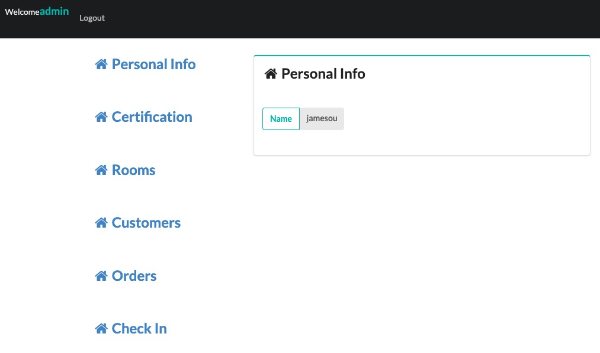
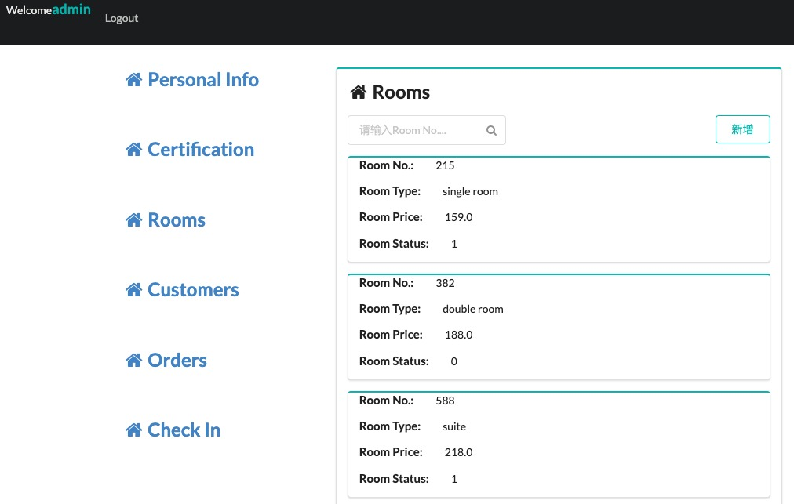

# Simple_Springboot_SpringMvc
## Description
This project is mainly based on Java8, using SpringBoot+Thymeleaf+Webjars+Mybatis+RabbitMq+Mysql to achieve a simple project of multiple languages of JavaWeb. It is based on a simple MVC three-layer architecture implementation and fits the majority of application system requirements.
## Snapshots

